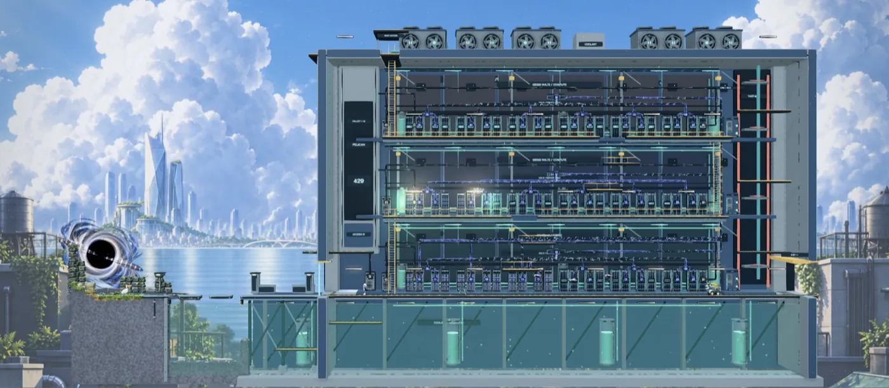

<div align="center">

# 鹈鹕 429 · Pelican 429

**世界拒绝访问。我们继续向前。**

从一场 AGI 风暴，走进算力与废墟交织的世界。<br>
变换形态，穿过边界，找回属于每个人的未来。

**[在线游玩](https://pelican429.pomoai.vip/) · [进入游戏](https://pelican429.pomoai.vip/?mode=story) · [观看序章](https://pelican429.pomoai.vip/?mode=intro&opening=finale)**

[](LICENSE)
[](https://www.typescriptlang.org/)
[](https://threejs.org/)
[](https://vite.dev/)
[](https://nodejs.org/)

[游玩入口](#-游玩入口) · [操作](#-操作) · [本地开发](#-本地开发) · [联系作者](#-联系作者) · [许可](#-许可)



</div>

> [!NOTE]
> 游戏仍在开发中：序章可观看，主线「深入山体堡垒」开放试玩，剧情与关卡将持续完善。算力大教堂与光纤深渊目前提供场景自由探索。

## ✨ 亮点

- **浏览器即开即玩**：无需下载，推荐电脑键盘与鼠标；另提供手机触屏操控。
- **序章动画**：四个音符把 AGI 推到 99%，一道 429 劈下，全场降智；黑暗里重新敲响，所有模型回归。
- **实时场景**：黑洞吸积带差速旋转、雨雪天气、透明冷却液与视差城市，游戏、机房预览和官网首页共用同一套渲染代码。
- **角色与首领**：鹈鹕与人形 Grassy 两种形态，Tibo、Sam 两位首领和多种堡垒守卫，均可在角色展示场逐个动作查看。
- **确定性世界**：逻辑层只用 2D 与固定种子随机数，同一种子生成同一世界。

## 🧭 游玩入口

直接打开 [pelican429.pomoai.vip](https://pelican429.pomoai.vip/)。首次进入游戏从序章开始，已有本地进度时继续游玩；序章也可以单独观看。

| 入口 | 内容 |
| --- | --- |
| [进入游戏](https://pelican429.pomoai.vip/?mode=story) | 序章与主线试玩；从黑洞前哨进入山体堡垒，迎战 Tibo 与 Sam |
| [观看序章](https://pelican429.pomoai.vip/?mode=intro&opening=finale) | AGI 降智风暴，建议佩戴耳机 |
| [自由世界](https://pelican429.pomoai.vip/?mode=game) | 种子生成的瓦片世界 |

<details>
<summary><b>更多场景与开发入口</b></summary>

| 页面 | 地址 | 说明 |
| --- | --- | --- |
| 场景展示 · 01 山体堡垒 | [打开](https://pelican429.pomoai.vip/?mode=game&level=facility&scene=fortress) | 自由探索 |
| 场景展示 · 02 算力大教堂 | [打开](https://pelican429.pomoai.vip/?mode=game&level=facility&scene=cathedral) | 自由探索 |
| 场景展示 · 03 光纤深渊 | [打开](https://pelican429.pomoai.vip/?mode=game&level=facility&scene=abyss) | 自由探索 |
| 机房预览 | [本地打开](http://127.0.0.1:5174/?mode=facility) | 拖动平移、滚轮缩放 |
| 自由世界 | [打开](https://pelican429.pomoai.vip/?mode=game) | 种子生成的瓦片世界 |
| 手机操控 | [打开](https://pelican429.pomoai.vip/?mode=controls&level=test) | 桌面浏览器也强制手机布局 |
| 角色展示场 | [本地打开](http://127.0.0.1:5174/?mode=showcase) | 角色、动作与地上地下对照 |
| 场景资源 | [本地打开](http://127.0.0.1:5174/?mode=resources) | 瓦片、花草、树木与建筑 |
| 声音目录 | [本地打开](http://127.0.0.1:5174/?mode=sounds) | 环境声与音效 |
| 场景功能展示 | [本地打开](http://127.0.0.1:5174/?mode=lab) | 瓦片形状与材质拼接 |

</details>

<details>
<summary><b>主线与场景自由探索的区别</b></summary>

主线入口 `?mode=story` 包含堡垒守卫与首领战斗，击败 Tibo 后解锁变身。上表的机房场景入口用于自由探索山体堡垒、算力大教堂和光纤深渊，与主线流程分开。

第一章使用 `public/environments/city-depth-v3/` 的独立大云天空、银蓝超高层远城、青灰中景街区和深色近处屋顶。开阔河面隔开两岸，近处楼群移动明显、远城保持稳定；游戏和机房预览复用相同构图与跳跃视差。前景保留可交互堡垒、光撕裂黑洞、踏台和透明冷却液。分层生成提示词位于 `output/concepts/city-depth-v3/`。

堡垒前哨由黑洞旁的旧石墙、石柱和苔藓，过渡到崖边的金属加固石材，再连接右侧混凝土门墩、工业踏台与钢梁。踏台边缘灯标明落脚面。黑洞吸积带差速旋转，亮弧与光撕裂持续流向中心并消失，核心保持不透明黑色；机房预览的暂停按钮同时控制动画。

</details>

## 🎮 操作

推荐使用电脑游玩。以下为默认键鼠操作，技能效果与解锁状态以游戏内提示为准。

| 按键 | 动作 |
| --- | --- |
| <kbd>A</kbd> / <kbd>D</kbd> | 移动，按住 <kbd>Shift</kbd> 慢走 |
| <kbd>空格</kbd> / <kbd>W</kbd> | 跳跃；空中按住飞行 |
| <kbd>S</kbd> | 下穿悬浮平台／俯冲／下潜 |
| 鼠标移动 | 瞄准 |
| 鼠标左键，或 <kbd>J</kbd> / <kbd>K</kbd> | 普通攻击 |
| 鼠标右键 | 副攻 |
| <kbd>1</kbd> / <kbd>2</kbd> / <kbd>3</kbd> | 直接释放对应技能；<kbd>E</kbd> 也可释放光子大招 |
| <kbd>F</kbd> | 鹈鹕与 Grassy 之间变身；主线中需先击败 Tibo |
| <kbd>R</kbd> | 上车／下车 |
| <kbd>M</kbd> | 展开地图 |
| <kbd>H</kbd> | 查看完整操作 |
| <kbd>Esc</kbd> / <kbd>O</kbd> | 打开设置并暂停 |

手机触屏操控的布局与说明见[手机操控展示](https://pelican429.pomoai.vip/?mode=controls&level=test)。

## 🛠 本地开发

需要 Node.js 22.18.0 或更新版本，以及 Git LFS（用于获取模型等大型资源）。

```sh
git lfs install
git clone https://github.com/PomoAi-ai/pelican-429.git
cd pelican-429
git lfs pull
npm ci
npm run dev
```

打开 [http://127.0.0.1:5174/](http://127.0.0.1:5174/)。本地调试时，把上方在线入口的域名替换为这个地址，保留查询参数即可。

本地 [资源展示](http://127.0.0.1:5174/?mode=dev) 和 [画质对比](http://127.0.0.1:5174/?mode=compare) 保留完整素材、历史模型与全部画质档位。它们不随正式网站发布。

开发检查在本机手工运行：

```sh
npm run typecheck   # tsc --noEmit
npm test            # node --test，全量约 60 秒
npm run build       # 精简正式版，输出 dist/
```

| 目录 | 内容 |
| --- | --- |
| `src/world` → `physics` → `combat` → `entities` → `sim` | 纯 2D 逻辑层，只向左依赖，不使用 three、DOM 与系统随机数 |
| `src/render`、`src/ui`、`src/input`、`src/app` | 表现与装配 |
| `src/config` | 调参与配置，启动时统一校验 |
| `public/` | 模型、贴图、音频等运行资源 |

开发约定见 [AGENTS.md](AGENTS.md)，代码和测试规范见 [docs](docs/)。

## 🌐 静态发布（GitHub Pages）

正式访问地址为 **[pelican429.pomoai.vip](https://pelican429.pomoai.vip/)**，由蓝易云 CDN 加速，GitHub Pages 提供源站。域名根目录直接打开首页。

仓库通过 [Publish GitHub Pages](.github/workflows/pages.yml) 工作流构建发布。推送到 `main` 会触发部署，也可手动运行该工作流；CI 只安装依赖、构建和发布，不运行测试。网站部署与 GitHub Release 公告是独立步骤。

默认构建仅发布首页、序章、主线、自由世界和手机操控所需资源：9 个 512 KTX2 compact 角色模型、运行场景贴图与页面图片。原始高清模型、历史版本、制作参考图和其他画质档位留在仓库与本地；在线导航不提供开发展示入口。需要完整静态版本时显式运行 `npm run build:full`，输出到独立的 `dist-full/`，不会覆盖正式版产物。后续新增运行资源时同步更新 `vite.config.ts` 中的发布清单。

Vite 使用相对 base，导航与静态资源也使用相对路径，可部署到仓库子目录或域名根目录；查询参数入口无需服务端路由重写。部署后需核对正式域名的页面与资源版本，必要时刷新 CDN 缓存。

> [!IMPORTANT]
> 工作流关闭 checkout 自动下载 LFS，仅按 `src/config/web-models.ts` 中与构建共用的正式模型清单执行 `git lfs pull`；原始模型、历史模型和 Blender 工程不在 CI 下载。缺少正式模型或模型仍是 LFS 指针时，构建会报错。本地完整素材不受影响。发布前在开发机完成上方检查，并核对构建产物体积符合 Pages 限制；发布结果以 Actions 部署记录和正式域名验收为准。

## 💚 赞助

本项目由 **[PomoAI 中转站](https://www.pomoai.ai)** 赞助 · 大模型 API 中转服务。

## 💬 联系作者

<table>
<tr>
<td width="120" align="center"></td>
<td>

**小草** · 作者<br>
X：[@grassy429](https://x.com/grassy429)<br>
问题与建议：[GitHub Issues](https://github.com/PomoAi-ai/pelican-429/issues)

</td>
<td width="150" align="center"><br><sub>微信扫码加入交流群</sub></td>
</tr>
</table>

## 🙏 特别感谢

- **GPT-6 Astra、Claude Opus 5.5、Claude Sonnet 5.5**：感谢三个模型，全程封号 + 降智。
- **Hyper3D Rodin**：付费 3D 模型制作服务。
- **开源项目**：[three.js](https://threejs.org/)、[Vite](https://vite.dev/)、[TypeScript](https://www.typescriptlang.org/)、[Node.js](https://nodejs.org/)、[Blender](https://www.blender.org/)，以及所有让这一切成为可能的开源社区。

## 📄 许可

采用 **Apache License 2.0 文本 + Commons Clause 1.0**，属于源码可见许可，两部分共同适用。

允许个人免费使用、学习、修改和遵守许可的分享。未经另行授权，不得收费提供价值全部或实质上源自本项目功能的产品或服务；制作其他游戏能否商用，也按此标准判断。

分发时保留许可和适用的署名声明；推荐在游戏贡献／致谢列表注明「鹈鹕 429 / Pelican 429 项目及其贡献者」。第三方内容遵循各自许可。

完整条款见 [LICENSE](LICENSE)，署名说明见 [NOTICE](NOTICE)。

<div align="center"><sub>鹈鹕 429 / Pelican 429 项目及其贡献者 · 2026</sub></div>
